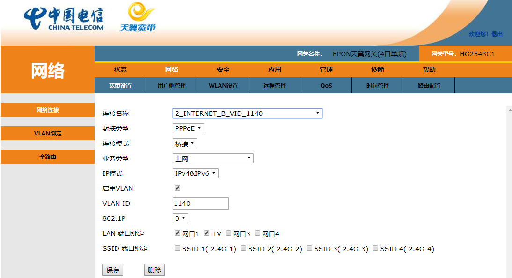
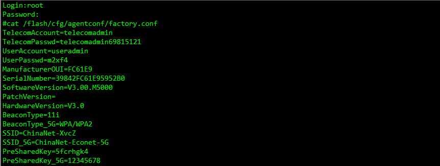

## 1. HG2543C1光猫路由模式改桥接模式

### 1.1 打开光猫telnet功能
浏览器访问 [http://192.168.1.1:8080/cgi-bin/telnetenable.cgi?telnetenable=1](http://192.168.1.1:8080/cgi-bin/telnetenable.cgi?telnetenable=1)
### 1.2 telnet进入光猫获取telecomadmin密码
登录用户名root，密码是默认wifi密码+默认useradmin密码，具体看光猫背面
cat /flash/cfg/agentconf/factory.conf 查看telecomadmin密码
cat /flash/cfg/app_conf/pppoe/chap-secrets 查看宽带账号和密码

### 1.3 使用telecomadmin账号登录
浏览器访问 [http://192.168.1.1:8080/cgi-bin/login.htm.cgi](http://192.168.1.1:8080/cgi-bin/login.htm.cgi)
打开网络--宽带设置，设置2_INTERNET_B_VID_xxxx连接方式为桥接，具体见下图

