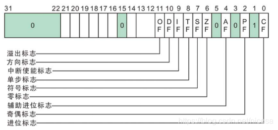

### 基本寄存器

* 通用寄存器

  | 名称    | 功能                                                         |
  | ------- | ------------------------------------------------------------ |
  | EAX     | 累加器(Accumulator)，可用于乘、除、输入/输出等操作，它们的使用频率很高 |
  | EBX     | 基地址寄存器(BaseRegister)，可作为存储器指针来使用           |
  | ECX     | 计数寄存器(CountRegister)，在循环和字符串操作时，要用它来控制循环次数；在位操作中，当移多位时，要用CL来指明移位的位数 |
  | EDX     | 数据寄存器(DataRegister)，进行乘、除运算时，它可作为默认的操作数参与运算，也可用于存放I/O的端口地址 |
  | EBP/ESP | 指针寄存器(PointerRegister)，主要用于存放堆栈内存储单元的偏移量，用它们可实现多种存储器操作数的寻址方式，为以不同的地址形式访问存储单元提供方便 |
  | ESI/EDI | 变址寄存器(IndexRegister)，它们主要用于存放存储单元在段内的偏移量，用它们可实现多种存储器操作数的寻址方式，为以不同的地址形式访问存储单元提供方便 |

* 段寄存器

  | 名称 | 功能                                                       |
  | ---- | ---------------------------------------------------------- |
  | CS   | 代码段寄存器(CodeSegmentRegister)，其值为代码段的段值      |
  | SS   | 堆栈段寄存器(StackSegmentRegister)，其值为堆栈段的段值     |
  | DS   | 数据段寄存器(DataSegmentRegister)，其值为数据段的段值      |
  | ES   | 附加段寄存器(ExtraSegmentRegister)，其值为附加数据段的段值 |
  | FS   | 附加段寄存器(ExtraSegmentRegister)，其值为附加数据段的段值 |
  | GS   | 附加段寄存器(ExtraSegmentRegister)，其值为附加数据段的段值 |

  

* 状态标志寄存器（EFLAGS）

  进位标志（CF）：在无符号算术运算的结果太大而超过目的操作数的内存大小时置位

  溢出标志（OF）：在有符号算术运算的结果太大或太小而超过目的操作数内存大小时置位

  符号标志（SF）：在算术或者逻辑运算的结果为负数时置位

  零标志（ZF）：在算术或者逻辑运算的结果为0时置位

  辅助进位标志（AC）：在算术运算导致8位操作数的位3或者位4产生进位时置位

  奇偶标志（PF）：结果的最低有效位字节为1的位的数目为偶数时置位，否则PF复位。

  

* 指令指针寄存器（EIP）

  EIP寄存器存放下一条要执行指令的地址，部分机器指令可以修改EIP，使程序分支转移到新的地址执行

