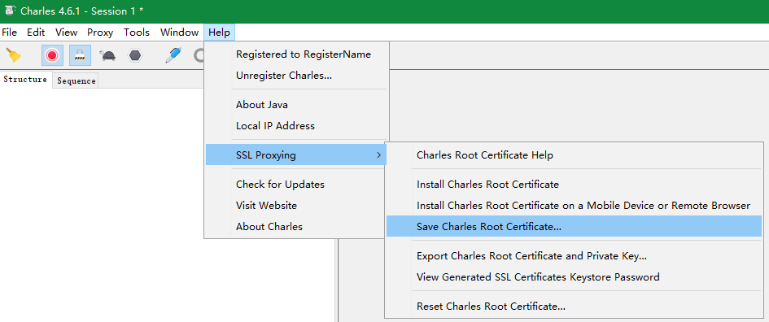

## 安卓逆向 - 1. 环境搭建

说明：本文相关工具下载地址[https://opensi.lanzouv.com/b03vepf6f ](https://opensi.lanzouv.com/b03vepf6f ) 密码:bd06

### 1. 安装安卓模拟器

* 雷电模拟器：

下载雷电模拟器并安装，官网地址[雷电模拟器官网](https://www.ldmnq.com/)，安装后打开

检查如下设置：

* 软件设置 - 性能设置 - 磁盘共享 - Sytem.vmdk可写入设置为勾选

* 软件设置 - 网络桥接模式设置为开启

* 其他设置 - ROOT权限设置为开启

* 夜神模拟器

下载夜神模拟器并安装，官网地址[夜神模拟器官网](https://www.yeshen.com/)，安装后打开

检查如下设置：

* 基础 - 开启root已勾选

### 2. 安装Magisk-Delta

下载Magisk-Delta app，然后直接拖到模拟器中

### 3. 安装Charles证书

安卓7.0及以上版本用户证书是不被信任的，所以需要将证书安装到系统证书目录中


* 保存证书到本地，保存文件格式选择pem格式

  

* adb连接模拟器并且挂载为可读写的

```
D:\develop\Android\certs>adb connect 127.0.0.1:62001
connected to 127.0.0.1:62001
  
D:\develop\Android\certs>adb root
adbd is already running as root
  
D:\develop\Android\certs>adb remount
remount succeeded
  
D:\develop\Android\certs>adb shell mount -o rw,remount /system
  
D:\develop\Android\certs>
```

* 复制证书文件到系统证书目录

```
D:\develop\Android\certs>openssl x509 -subject_hash_old -in charles.pem
a513c517
-----BEGIN CERTIFICATE-----
MIIFLDCCBBSgAwIBAgIGAYCegsDpMA0GCSqGSIb3DQEBCwUAMIGaMSswKQYDVQQD
DCJDaGFybGVzIFByb3h5IENBICg3IE1heSAyMDIyLCBNQUMpMSUwIwYDVQQLDBxo
dHRwczovL2NoYXJsZXNwcm94eS5jb20vc3NsMREwDwYDVQQKDAhYSzcyIEx0ZDER
MA8GA1UEBwwIQXVja2xhbmQxETAPBgNVBAgMCEF1Y2tsYW5kMQswCQYDVQQGEwJO
WjAeFw0yMjA1MDYxMjMzMzBaFw0yMzA1MDYxMjMzMzBaMIGaMSswKQYDVQQDDCJD
aGFybGVzIFByb3h5IENBICg3IE1heSAyMDIyLCBNQUMpMSUwIwYDVQQLDBxodHRw
czovL2NoYXJsZXNwcm94eS5jb20vc3NsMREwDwYDVQQKDAhYSzcyIEx0ZDERMA8G
A1UEBwwIQXVja2xhbmQxETAPBgNVBAgMCEF1Y2tsYW5kMQswCQYDVQQGEwJOWjCC
ASIwDQYJKoZIhvcNAQEBBQADggEPADCCAQoCggEBAMa++t42F9V8sSMN2m+I5J99
PAHX1qV2imgxbAYRGcX+upWGN9Mo28LYKLHQ4ocIWKYC7jAx0MDE6nQnjjVlBBic
yPFg6NU3VLTfBDjd6UDMeQpeOfsEqFaTQYwTumop+0yNpXYdQo/YrWqOqbW6/VlH
k6TxOTpNcF0viCTUdsiF3d6tOVAHsOhPuPo5FcTb5pgm+fN9xxhZvU5LZupk8usm
7D0z6mzw/qTyWU5QqLGj6urQ5clXZ1ZzKrayBxDmGF6HwpSjauBgn1JzJ8iDcaLM
8BPcDxEsuqRchInp2FY3N/rCTwnZMmeZsA8mrlNtFb5ySDZdz0uHbcopxoN8Ib0C
AwEAAaOCAXQwggFwMA8GA1UdEwEB/wQFMAMBAf8wggEsBglghkgBhvhCAQ0EggEd
E4IBGVRoaXMgUm9vdCBjZXJ0aWZpY2F0ZSB3YXMgZ2VuZXJhdGVkIGJ5IENoYXJs
ZXMgUHJveHkgZm9yIFNTTCBQcm94eWluZy4gSWYgdGhpcyBjZXJ0aWZpY2F0ZSBp
cyBwYXJ0IG9mIGEgY2VydGlmaWNhdGUgY2hhaW4sIHRoaXMgbWVhbnMgdGhhdCB5
b3UncmUgYnJvd3NpbmcgdGhyb3VnaCBDaGFybGVzIFByb3h5IHdpdGggU1NMIFBy
b3h5aW5nIGVuYWJsZWQgZm9yIHRoaXMgd2Vic2l0ZS4gUGxlYXNlIHNlZSBodHRw
Oi8vY2hhcmxlc3Byb3h5LmNvbS9zc2wgZm9yIG1vcmUgaW5mb3JtYXRpb24uMA4G
A1UdDwEB/wQEAwICBDAdBgNVHQ4EFgQUtErVj2eM4nOUKb+qyLcmlRGwv88wDQYJ
KoZIhvcNAQELBQADggEBADGCUgo14D6d/CW91eS0BZvTij1Il2l24Pu0fHT950jV
HMyjPuE0KJrZRdPrWf7l/eixlhZuJ1//I/k1CNtl7BFOTUXivkITOk/gjWwRNk/G
KC89IOBP+x1BPgDGCACHE3FRJ4I9PPBUeRDmHmX/gebPV68dik1CnIXMbQa3yWrC
Ht9sGNenuJJ4lDEM/nnTzI/evmklMOwtLtJi+IfU5g5Py7pm9QQ+q5+PXsrKI6aG
qujYHR7ne03X2T+TklTaZVpfDjHIkSMcKAGzqmFaG3Mlxay9vHutouLsyn3YH34P
s5LSpgRQfslOE5E95QH+Z205djJdkn5yq3Vhkt92sF0=
-----END CERTIFICATE-----
  
D:\develop\Android\certs>cp charles.pem a513c517.0
  
D:\develop\Android\certs>adb push a513c517.0 /system/etc/security/cacerts
a513c517.0: 1 file pushed, 0 skipped. 5.2 MB/s (1876 bytes in 0.000s)
```

注：如果是crt/der格式证书需要转换成pem格式证书

```
D:\develop\Android\certs>openssl x509 -in burpsuite.der -inform DER -out burpsuite.pem -outform PEM

D:\develop\Android\certs>openssl x509 -subject_hash_old -in burpsuite.pem
9a5ba575
-----BEGIN CERTIFICATE-----
MIIDqDCCApCgAwIBAgIFAKGALqwwDQYJKoZIhvcNAQELBQAwgYoxFDASBgNVBAYT
C1BvcnRTd2lnZ2VyMRQwEgYDVQQIEwtQb3J0U3dpZ2dlcjEUMBIGA1UEBxMLUG9y
dFN3aWdnZXIxFDASBgNVBAoTC1BvcnRTd2lnZ2VyMRcwFQYDVQQLEw5Qb3J0U3dp
Z2dlciBDQTEXMBUGA1UEAxMOUG9ydFN3aWdnZXIgQ0EwHhcNMTQxMTE1MTQwMjM1
WhcNMzIxMTE1MTQwMjM1WjCBijEUMBIGA1UEBhMLUG9ydFN3aWdnZXIxFDASBgNV
BAgTC1BvcnRTd2lnZ2VyMRQwEgYDVQQHEwtQb3J0U3dpZ2dlcjEUMBIGA1UEChML
UG9ydFN3aWdnZXIxFzAVBgNVBAsTDlBvcnRTd2lnZ2VyIENBMRcwFQYDVQQDEw5Q
b3J0U3dpZ2dlciBDQTCCASIwDQYJKoZIhvcNAQEBBQADggEPADCCAQoCggEBANus
lL54ESmpiNLcfxeWb8vEQqCoHkiyKihZqtej1A/ew/9Ab4NLRj1IU4Nj1wjMHGBl
fA9oooT/7esUxu8FU3aLkAJWJO1kDKVHUoornI4T0IKy/LD5XJhWtoVTu7xH25m2
JjAAVJDTtGj0HEda8/bC56qYjGMLCVBiAjfMS0fKSkl6ducqK5YNExhBrMeIM6Vu
wcwbWNlSQr0e5mDlQMkYmULH8Wsxwnv1RnlqZHQ0DCxIxW6oWPR8td2heIVkLIQT
hiv8zLOG2Fk/4In0LuvNS0yvGYvni6kcEnxZsfTySVzoEb/ell8pnowP1QlncRGM
yWLs2jnTE27WnUh9DHMCAwEAAaMTMBEwDwYDVR0TAQH/BAUwAwEB/zANBgkqhkiG
9w0BAQsFAAOCAQEAsIF8UhiUxMo2KF2lxjeHhtSkjO5l6eR4xdjUnvdEVI86Cb5X
uM6yz9X7Cl/LhreQlaN5mrMD/DqsP46leq8wVz6+Ql+lq5fdF3khbm9xBUpPdETb
bZEk24XzM0mNr6i3+0kX0dX+ZeMSUnfs5dyivgfT1Dm0AR7dEXY/GkKYG4XfRjIf
C4oDGfeL4lZ3a3mDedMIeOKrvR7q/iAGuiiONXWvBERegCGfqqTsruvMx5ZnnUrn
s9q+bXsL1NfQI7DNB0lJcZ+3HO/biw3uiglQaTJ1DN/yv5RVC9xk9FFzFsjsRgQ0
UHG2b9QjqAcUdD++EeMd8HDxzsLgrtuERFcaoQ==
-----END CERTIFICATE-----

D:\develop\Android\certs>cp burpsuite.pem 9a5ba575.0

D:\develop\Android\certs>adb push 9a5ba575.0 /system/etc/security/cacerts
9a5ba575.0: 1 file pushed, 0 skipped. 3.6 MB/s (1330 bytes in 0.000s)
```


